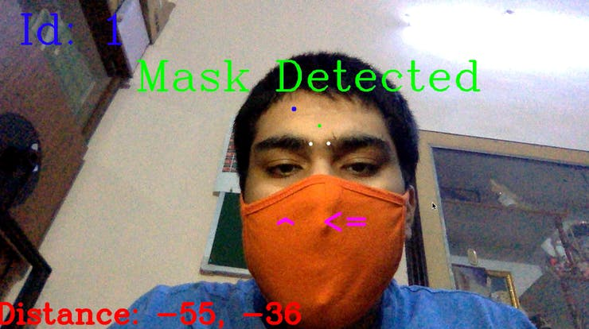
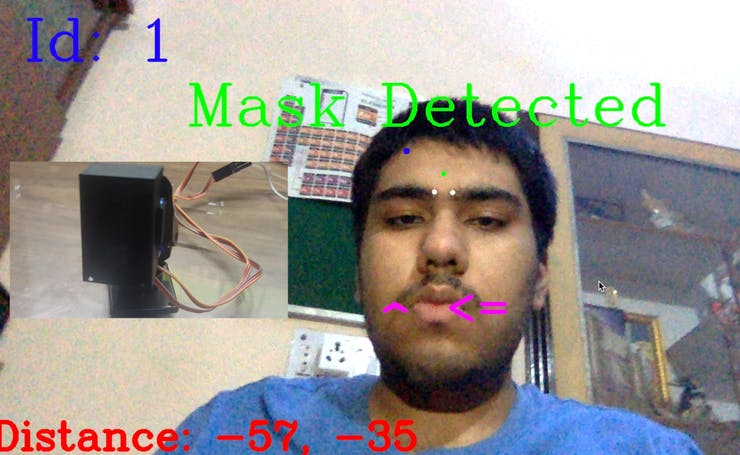
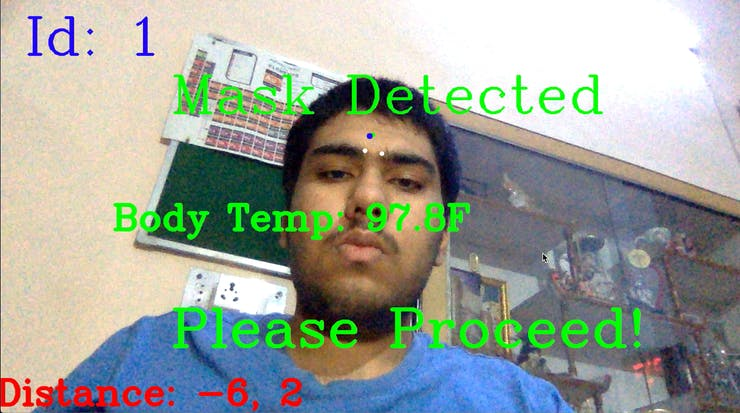
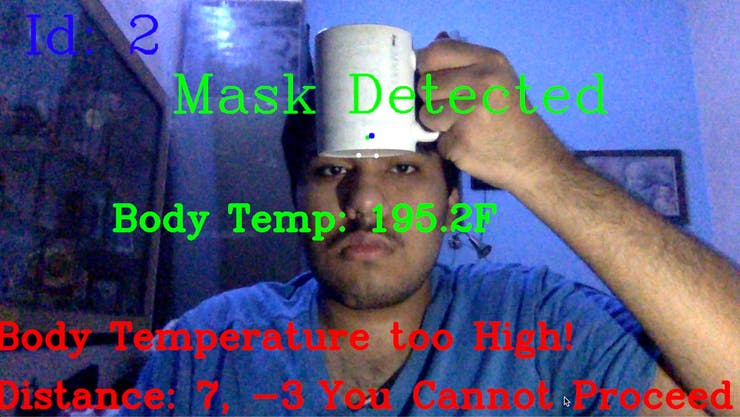

# TouchFree v1
### Automated Temperature Checker using Facial Landmarking and Mask Detection using Deep Learning Neural Network

## Screenshots

Firstly, the Tensorflow based Deep Learning Neural Network tries to detect if the person is wearing a Mask or not. The System has been made Robust by training it with many different examples to prevent False Positives.

Once, the System has detected the Mask it asks the user to remove the mask so that it can perform Facial Landmarking. The System is using DLIB Module for Facial Landmarking to find the best Spot on the Forehead of the person to take Temperature from.

Then by using PID Control System with Servo Motors, the system tries to align the Selected Spot on the Forehead with the Sensor. Once aligned the system takes Temperature Reading using Contactless IR Temperature Sensor.

If the temperature is within normal Human Body Temperature range it allows the Person to Proceed and sends an email to the Admin with a Picture and other Details like Body Temperature, etc.

